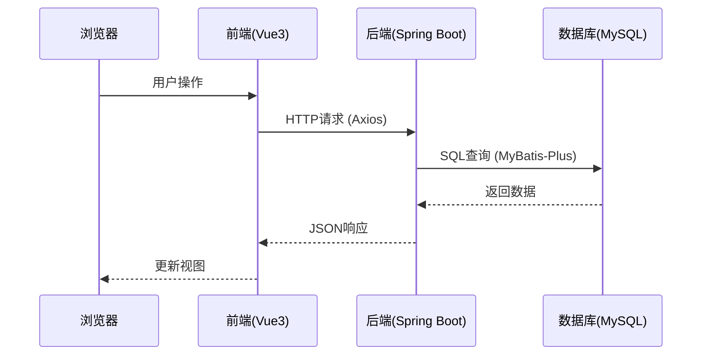
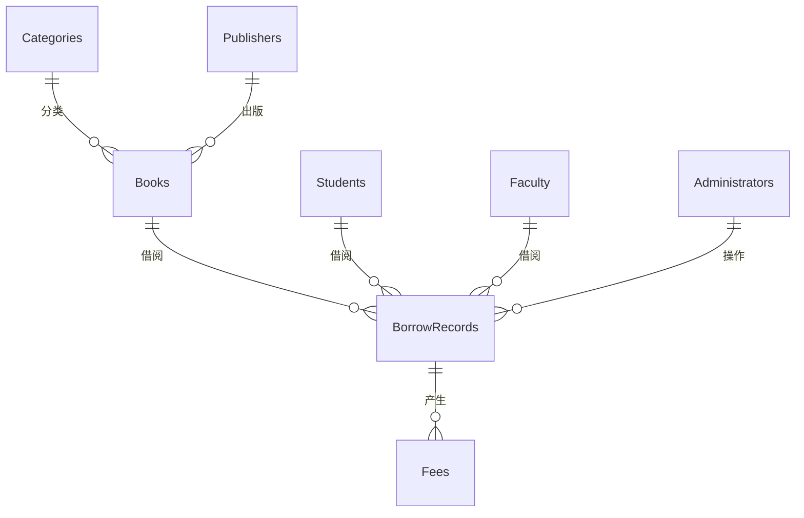
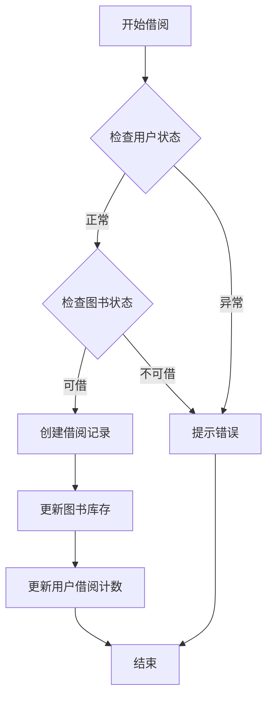
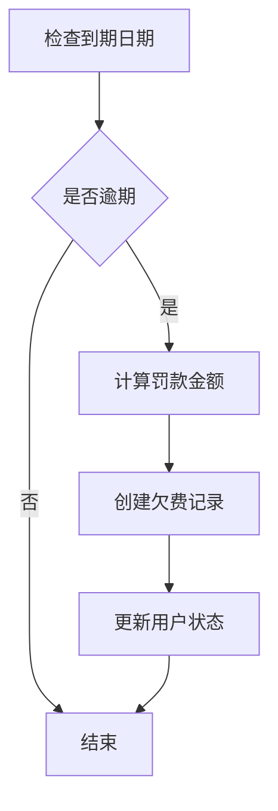

# 图书管理系统技术实现文档

## 一、系统架构

### 1. 整体架构
本系统采用前后端分离架构：
- 前端：Vue3 + Element Plus（端口：3000）
- 后端：Spring Boot + MyBatis-Plus（端口：8080）
- 数据库：MySQL 8.0

### 2. 通信流程


## 二、数据库设计与实现

### 1. 表关系图


### 2. 核心表及其作用

#### 2.1 图书相关表
1. `Books`（图书信息表）
   - 主要字段：book_id, title, author, category_id, publisher_id, total_count, available_count
   - 作用：存储图书基本信息和库存状态
   - 关联表：Categories（分类）, Publishers（出版社）
   - 示例查询：
     ```sql
     -- 查询可借阅的图书
     SELECT * FROM Books WHERE available_count > 0 AND status = '在架';
     
     -- 按分类统计图书数量
     SELECT c.category_name, COUNT(*) as book_count 
     FROM Books b 
     JOIN Categories c ON b.category_id = c.category_id 
     GROUP BY c.category_name;
     ```

2. `Categories`（图书分类表）
   - 主要字段：category_id, category_name, parent_id
   - 作用：实现图书分类管理，支持多级分类
   - 示例查询：
     ```sql
     -- 查询所有顶级分类及其子分类
     SELECT p.category_name as parent, c.category_name as child
     FROM Categories p
     LEFT JOIN Categories c ON c.parent_id = p.category_id
     WHERE p.parent_id IS NULL;
     ```

#### 2.2 用户相关表
1. `Students`（学生表）
   - 主要字段：student_id, name, department, borrow_count, is_overdue
   - 作用：存储学生信息和借阅状态
   - 业务规则：
     - 最大借阅数量限制
     - 逾期状态跟踪
     - 欠费金额统计

2. `Faculty`（教职工表）
   - 主要字段：faculty_id, name, department, title, borrow_count
   - 作用：存储教职工信息和借阅状态
   - 特殊规则：
     - 较长的借阅期限
     - 较大的借阅数量限制

3. `Administrators`（管理员表）
   - 主要字段：admin_id, username, password, role
   - 作用：系统管理员账号管理
   - 权限控制：
     ```sql
     -- 查询管理员权限
     SELECT username, role FROM Administrators 
     WHERE username = ? AND password = ?;
     ```

#### 2.3 业务相关表
1. `BorrowRecords`（借阅记录表）
   - 主要字段：record_id, user_id, user_type, book_id, borrow_date, due_date
   - 作用：记录所有借阅交易
   - 核心业务查询：
     ```sql
     -- 查询用户当前借阅
     SELECT b.title, br.borrow_date, br.due_date
     FROM BorrowRecords br
     JOIN Books b ON br.book_id = b.book_id
     WHERE br.user_id = ? AND br.status = '借阅中';
     
     -- 统计逾期记录
     SELECT user_id, COUNT(*) as overdue_count
     FROM BorrowRecords
     WHERE due_date < CURRENT_DATE AND return_date IS NULL
     GROUP BY user_id;
     ```

2. `Fees`（欠费记录表）
   - 主要字段：fee_id, user_id, user_type, record_id, fee_type, amount
   - 作用：管理罚款和赔偿费用
   - 业务场景：
     - 逾期罚款
     - 损坏赔偿
     - 丢失赔偿
   - 示例查询：
     ```sql
     -- 查询用户未缴费用
     SELECT fee_type, SUM(amount) as total_amount
     FROM Fees
     WHERE user_id = ? AND status = '未缴'
     GROUP BY fee_type;
     ```

## 三、前后端通信与数据库交互

### 1. 前端Vue3与后端Spring Boot的通信

#### 1.1 前端API封装
前端使用Axios进行HTTP请求，采用模块化的方式组织API调用：

```javascript
// frontend/src/api/book.js
import axios from 'axios'

// 获取所有图书
export function getBooks() {
  return axios.get('/books')
}

// 获取单本图书
export function getBookById(id) {
  return axios.get(`/books/${id}`)
}

// 添加图书
export function addBook(book) {
  return axios.post('/books', book)
}

// 更新图书
export function updateBook(book) {
  return axios.put('/books', book)
}

// 删除图书
export function deleteBook(id) {
  return axios.delete(`/books/${id}`)
}
```

#### 1.2 后端Controller处理
后端使用Spring Boot的RESTful API处理前端请求：

```java
@RestController
@RequestMapping("/borrow-records")
public class BorrowRecordController {
    @Autowired
    private BorrowRecordService borrowRecordService;

    // 获取借阅记录列表
    @GetMapping
    public Map<String, Object> list(@RequestParam(required = false) String userId,
                                  @RequestParam(required = false) String userType) {
        Map<String, Object> result = new HashMap<>();
        QueryWrapper<BorrowRecord> queryWrapper = new QueryWrapper<>();
        
        // 根据用户类型过滤记录
        if (userType != null && userType.equals("admin")) {
            // 管理员可以查看所有记录
        } else if (userId != null && userType != null) {
            // 普通用户只能查看自己的记录
            queryWrapper.eq("user_id", userId)
                      .eq("user_type", userType);
        }
        
        List<BorrowRecord> records = borrowRecordService.list(queryWrapper);
        
        result.put("code", 0);
        result.put("msg", "获取借阅记录成功");
        result.put("data", records);
        return result;
    }
}
```

### 2. 后端Spring Boot与MySQL的通信

#### 2.1 实体类（Model层）
使用MyBatis-Plus注解映射数据库表：

```java
@Data
@TableName("borrowrecords")
public class BorrowRecord {
    @TableId("record_id")
    private Integer recordId; // 借阅记录唯一标识
    
    @TableField("user_id")
    private String userId; // 借阅人唯一标识
    
    @TableField("user_type")
    private String userType; // 借阅人类型
    
    @TableField("book_id")
    private String bookId; // 图书ID
    
    @TableField("borrow_date")
    private Date borrowDate; // 借阅日期
    
    @TableField("due_date")
    private Date dueDate; // 应还日期
    
    @TableField("return_date")
    private Date returnDate; // 实际归还日期
    
    @TableField("status")
    private String status; // 借阅状态
    
    @TableField("fine_amount")
    private BigDecimal fineAmount; // 罚金金额
    
    @TableField(exist = false)
    private Book book; // 关联的图书信息（非数据库字段）
}
```

#### 2.2 Mapper接口（DAO层）
继承MyBatis-Plus的BaseMapper获得基础CRUD功能：

```java
@Mapper
public interface BorrowRecordMapper extends BaseMapper<BorrowRecord> {
    // MyBatis-Plus提供基础的CRUD操作
    // 可以在这里添加自定义的SQL查询方法
}
```

#### 2.3 Service层
使用MyBatis-Plus的ServiceImpl简化业务逻辑实现：

```java
@Service
public class BorrowRecordServiceImpl extends ServiceImpl<BorrowRecordMapper, BorrowRecord> implements BorrowRecordService {
    // 继承ServiceImpl获得基础的CRUD操作实现
    // 可以在这里添加自定义的业务逻辑
}
```

### 3. 完整业务流程示例

以借阅图书为例，展示完整的数据流程：

1. 前端发起请求：
```javascript
// frontend/src/api/borrow.js
export function borrowBook(data) {
  return axios.post('/borrow-records/borrow', data)
}
```

2. 后端Controller接收并处理请求：
```java
@PostMapping("/borrow")
public Map<String, Object> borrowBook(@RequestBody Map<String, Object> borrowDTO) {
    Map<String, Object> result = new HashMap<>();
    try {
        // 1. 获取请求参数
        String userId = (String) borrowDTO.get("userId");
        String userType = (String) borrowDTO.get("userType");
        String bookId = (String) borrowDTO.get("bookId");
        
        // 2. 创建借阅记录
        BorrowRecord record = new BorrowRecord();
        record.setUserId(userId);
        record.setUserType(userType);
        record.setBookId(bookId);
        record.setBorrowDate(new Date());
        
        // 3. 设置借阅期限
        Calendar cal = Calendar.getInstance();
        if ("student".equals(userType)) {
            cal.add(Calendar.DAY_OF_MONTH, 30); // 学生30天
        } else if ("faculty".equals(userType)) {
            cal.add(Calendar.DAY_OF_MONTH, 60); // 教职工60天
        }
        record.setDueDate(cal.getTime());
        
        // 4. 保存记录到数据库
        borrowRecordService.save(record);
        
        result.put("code", 0);
        result.put("msg", "借阅成功");
    } catch (Exception e) {
        result.put("code", 1);
        result.put("msg", "借阅失败: " + e.getMessage());
    }
    return result;
}
```

3. MyBatis-Plus生成并执行SQL：
```sql
-- MyBatis-Plus自动生成的SQL语句
INSERT INTO borrowrecords (
    user_id, user_type, book_id, borrow_date, 
    due_date, status, operator_id
) VALUES (
    #{userId}, #{userType}, #{bookId}, #{borrowDate}, 
    #{dueDate}, '借阅中', #{operatorId}
)
```

### 4. 技术特点

1. 前后端分离优势：
   - 前端独立开发和部署
   - 接口规范统一
   - 更好的用户体验
   - 便于扩展和维护

2. MyBatis-Plus特性：
   - 自动生成SQL
   - 丰富的CRUD接口
   - 强大的条件构造器
   - 支持分页查询
   - 性能优化

3. 数据一致性保证：
   - 事务管理
   - 乐观锁
   - 并发控制
   - 异常处理

## 四、关键业务实现

### 1. 借阅流程


实现代码：
```java
@Transactional
public boolean borrowBook(String userId, String bookId) {
    // 1. 检查用户状态
    User user = userMapper.selectById(userId);
    if (user.getIsOverdue() || user.getBorrowCount() >= maxBorrowLimit) {
        return false;
    }
    
    // 2. 检查图书状态
    Book book = bookMapper.selectById(bookId);
    if (book.getAvailableCount() <= 0) {
        return false;
    }
    
    // 3. 创建借阅记录
    BorrowRecord record = new BorrowRecord();
    record.setUserId(userId);
    record.setBookId(bookId);
    record.setBorrowDate(new Date());
    record.setDueDate(calculateDueDate(user.getType()));
    borrowRecordMapper.insert(record);
    
    // 4. 更新图书库存
    book.setAvailableCount(book.getAvailableCount() - 1);
    bookMapper.updateById(book);
    
    // 5. 更新用户借阅计数
    user.setBorrowCount(user.getBorrowCount() + 1);
    userMapper.updateById(user);
    
    return true;
}
```

### 2. 欠费处理


实现代码：
```java
@Scheduled(cron = "0 0 1 * * ?")  // 每天凌晨1点执行
public void checkOverdueFees() {
    // 1. 查找所有逾期未还的借阅记录
    List<BorrowRecord> overdueRecords = borrowRecordMapper.selectOverdueRecords();
    
    for (BorrowRecord record : overdueRecords) {
        // 2. 计算逾期天数和罚款金额
        int overdueDays = calculateOverdueDays(record.getDueDate());
        BigDecimal fineAmount = calculateFineAmount(overdueDays, record.getUserType());
        
        // 3. 创建或更新欠费记录
        Fee fee = new Fee();
        fee.setUserId(record.getUserId());
        fee.setRecordId(record.getRecordId());
        fee.setAmount(fineAmount);
        feeMapper.insert(fee);
        
        // 4. 更新用户逾期状态
        updateUserOverdueStatus(record.getUserId(), true);
    }
}
```

## 五、性能优化

### 1. 索引设计
```sql
-- 图书表索引
CREATE INDEX idx_book_category ON Books(category_id);
CREATE INDEX idx_book_publisher ON Books(publisher_id);
CREATE INDEX idx_book_status ON Books(status);

-- 借阅记录表索引
CREATE INDEX idx_borrow_user ON BorrowRecords(user_id, user_type);
CREATE INDEX idx_borrow_book ON BorrowRecords(book_id);
CREATE INDEX idx_borrow_status ON BorrowRecords(status);

-- 欠费表索引
CREATE INDEX idx_fee_user ON Fees(user_id, user_type);
CREATE INDEX idx_fee_status ON Fees(status);
```

### 2. 查询优化
1. 使用视图简化复杂查询
```sql
-- 创建用户借阅统计视图
CREATE VIEW user_borrow_stats AS
SELECT 
    user_id,
    user_type,
    COUNT(*) as total_borrows,
    SUM(CASE WHEN status = '借阅中' THEN 1 ELSE 0 END) as current_borrows,
    SUM(CASE WHEN status = '逾期' THEN 1 ELSE 0 END) as overdue_count
FROM BorrowRecords
GROUP BY user_id, user_type;
```

2. 使用存储过程处理复杂业务逻辑
```sql
DELIMITER //
CREATE PROCEDURE process_return_book(
    IN p_record_id INT,
    IN p_return_date DATE
)
BEGIN
    DECLARE v_due_date DATE;
    DECLARE v_fine_amount DECIMAL(10,2);
    
    -- 获取应还日期
    SELECT due_date INTO v_due_date
    FROM BorrowRecords
    WHERE record_id = p_record_id;
    
    -- 计算并插入罚款记录
    IF p_return_date > v_due_date THEN
        SET v_fine_amount = DATEDIFF(p_return_date, v_due_date) * 0.5;
        
        INSERT INTO Fees(user_id, record_id, amount, due_date)
        SELECT user_id, p_record_id, v_fine_amount, DATE_ADD(p_return_date, INTERVAL 7 DAY)
        FROM BorrowRecords
        WHERE record_id = p_record_id;
    END IF;
    
    -- 更新借阅记录
    UPDATE BorrowRecords
    SET return_date = p_return_date,
        status = '已归还'
    WHERE record_id = p_record_id;
    
    -- 更新图书库存
    UPDATE Books b
    JOIN BorrowRecords br ON b.book_id = br.book_id
    SET b.available_count = b.available_count + 1
    WHERE br.record_id = p_record_id;
END //
DELIMITER ;
```

## 六、安全性考虑

### 1. 数据库安全
1. 用户权限控制
```sql
-- 创建应用程序用户
CREATE USER 'library_app'@'localhost' IDENTIFIED BY 'complex_password';

-- 授予必要权限
GRANT SELECT, INSERT, UPDATE, DELETE ON library_db.* TO 'library_app'@'localhost';

-- 禁止直接访问用户表
REVOKE ALL ON library_db.administrators FROM 'library_app'@'localhost';
GRANT SELECT, UPDATE ON library_db.administrators TO 'library_app'@'localhost';
```

2. 敏感数据加密
```sql
-- 更新用户密码时进行加密
UPDATE Administrators 
SET password = SHA2(CONCAT(password, salt), 256) 
WHERE admin_id = ?;
```

### 2. 事务管理
```java
@Transactional(rollbackFor = Exception.class)
public void processReturn(Long recordId) {
    // 1. 更新借阅记录
    BorrowRecord record = borrowRecordMapper.selectById(recordId);
    record.setReturnDate(new Date());
    record.setStatus("已归还");
    borrowRecordMapper.updateById(record);
    
    // 2. 更新图书库存
    Book book = bookMapper.selectById(record.getBookId());
    book.setAvailableCount(book.getAvailableCount() + 1);
    bookMapper.updateById(book);
    
    // 3. 处理逾期费用
    if (isOverdue(record)) {
        createOverdueFee(record);
    }
}
```

## 七、监控和维护

### 1. 性能监控
```sql
-- 查询执行时间较长的SQL
SELECT * FROM information_schema.PROCESSLIST
WHERE Command != 'Sleep'
AND Time > 10
ORDER BY Time DESC;

-- 查询表的大小和索引使用情况
SELECT 
    table_name,
    table_rows,
    data_length/1024/1024 as data_size_mb,
    index_length/1024/1024 as index_size_mb
FROM information_schema.TABLES
WHERE table_schema = 'library_db'
ORDER BY data_length DESC;
```

### 2. 定期维护
```sql
-- 优化表
OPTIMIZE TABLE Books, BorrowRecords, Fees;

-- 分析表
ANALYZE TABLE Books, BorrowRecords, Fees;

-- 检查并修复表
CHECK TABLE Books, BorrowRecords, Fees;
REPAIR TABLE Books, BorrowRecords, Fees;
``` 